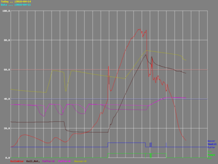

# knx-Bus-Simulator
=================

## README ME - UNDERSTAND ME !!!
===

THIS IS ONLY PROOF OF CONCEPT AND DEMO SOFTWARE WHICH IS NOT SUITABLE FOR A REAL WORLD SYSTEM.

## Revision History
===

 Date       | Version | Features/Changes                                        
 ---------- | ------- | --------------------------------------------------------
 2016-03-15 | PA5     | Signficant changes to the code structure; Migrated to cmake ( at least a humble first step);


## Current Issues 
===
- Too fast sending causes second message to be lost. A nasty little sleep(1) is need in order to keep things working.  
This is being worked on.

- Some messages, esp. coming from ETS4 S/W fail to disassemble  
It's probably my ownincompetence standing in my way to figure out the faults. Working on it.

## Wanna help?
===
If you feel like helping towards whatever the goal of this projetc might be or become, please get in touch.
## Before we start:
===
Please note that, however you use this toolset, which is provided as is and without any warranty or suitability for a specific purpose,
nothing contained herein has been run through any certification or validation of the KNX organisation or any certified authentication centre.
It is provided as starting point and in the hope that it may be useful to you.

The provided code is nothing for the faint hearted. There are little comments for now.
The whole thing should still be factor 1000 easier to read than anything else you might find anywhere.

All intelligence required about the EIB/KNX bus to develop the code contained herein was gained by reading:

"Serial Data Transmission and KNX Protocol", provided by KNX Association,
"EIB-TP-UART-IC", provided by Siemens, Regensburg

Both of these documents are freely available in the internet provided by their respective copyright holders.

!!!!! DO NOT USE ANY OF THIS SOFTWARE IN A PRODUCTIVE EIB/KNX BUS INSTALLATION !!!!!

If you wanna play with this stuff with some real KNX HW I suggest you start with a power supply, a simple sensor
like for example a 2-gang KNX push button and a cheap actor. These you will have to program - for now - with 
a suitable ETS Software (the 3-devices version is to my knowledge still FOC - free of charge).

In my test environment the S/W is running with a current "uptime" of 67 days (which is only due to installation of updated version).

## How to build:
===

Go to the folder where everything has landed, and - in there - create (and change to) the build subdirectory.

```
$ mkdir build
$ cd build
$ cmake ..
$ make -j4
```

Install the files to the /usr/bin and /usr/lib directory (nothing should interefer with any of your other stuff):

```
$ sudo make install
```

Create the config file directory and copy the 

```
$ sudo mkdir /etc/knx.d
$ sudo cp ../knx.d/baos.xml.sample /etc/knx.d/baos.xml
```

and edit, given root privilidges, the baos configuration file as needed.

## Some Background
===

This toolset was developed in order to facilitate the development and testing of scripts which run my own home automation, based on KNX bus. As I'm primarily running Mac OS, at least as long as I don't have to program KNX devices with ETS4, the natural choice became Mac OS for running this toolset. On the other hand there's the need to hook up to some real H/W, which in my case comes down to a Raspberry Pi extended with a Busware TPUART interface (which I can highly recommend).  
Using any of the data from a WebBrowser was not a goal in the beginning, but it might become one shortly.  
This shall be based on WebSockets, as the humble first rudimentary implementation - not really tested - indicates.
Everything will compile on Mac OS (using __MACH__ pre-compiler setting) and Raspberry Pi (without __MACH__ pre-compiler setting).
Nothing else is planned to be supported!

Some of the provided files stem from a former tryout and will not work for now!

The whole system is based on a lot of shared memory and semaphores. Therefor you need to start, and subsequently termintate, processes
in a certain order. This order is:

```
 #
 # this program does nothing but start a shared memory segment
 #
 knxbackbone &
 #
 # simulates (MacOS)/communicates to the real TPUART
 # if knxtpbridge-process is killed there may remain a process file under
 # /tmp/knxtpbridge_  
 # This file needs to be manually removed in case knxtpbridge shall be restarted.
 #
 knxtpbridge &
 #
 # log all message in human readble format to the given file
 #
 knxtrace -m 3 -file /var/log/knx/knx.log &
 #
 # monitors the grou objects specified in the file knx.d/baos.xml
 #
 knxmon &
```
You won't see much as output from these processes (which you might want to start with the debug option -D <level=0....>).

To see what's happening on the bus in human readbale, still hex encoded form, type:

```
tail -f /var/log/knx/knx.log	
```

### knxbackbone
===
This process doesn't really do much. In fact it simply creates a shared memory segment and ... well, nothing else. This shared memory segment obtains its structure through "eib.c" and "eib.h", which are the one library for accessing this shared memory segment.
Every application has, by being linked against eib.o (or the library where it resides) access to this simulated knx bus, be it the knxtpbridge, or the knxmon or the sendDATATYPE programs. Each application also obtains an APN (Access Port Number) which uniquely identifies this application user.  
Every message to be send somewhere is put into this queue (together with its APN), where it may stay forever- or until it's overwritten - if no other process cares. That's where knxtpbridge comes into the game.  
  
***Note:*** eib provides the interface towards the ***knxbackbone*** and manages the APNs. An APN needs to be requested through the application. A participant without an APN should not write messages to the knxbackbone. This has been done since there could be many users only requiring read access to the eib/knx bus while never writing anything to it.
### knxtpbridge
===
##### simulated knxtpbridge (MacOS)
===
Im Simulation mode knxtpbridge basically listens to new messages with **APNs different from its own APN** on the ***knxbackbone*** and "loops-back" these messages to the ***knxbackbone*** with **its own APN**.
This behaviour is necessary as this simulates exactly what's happening on a one wire bus like the EIB/KNX bus.  
***NOTE:*** this behaviour misses one aspect from a real system, i.e. the collisions, which could (and will at some point in time) be simulated. However, right now the simulated knxtpbridge is a collision free bus. 
##### real knxtpbridge (Raspberry/Jessie)
===
The real-life knxtpbridge basically listens to new messages with on the RS-232 port through the TPUART interface and "enters" these messages to the knxbackbone with **its own APN**.
A loopback to the interbak ***knxbackbone*** is notnecessary since - fue to the onewire bus nature - the message is immediately received through the very same TPUART device.
### knxmon
===
knxmon is a knx monitor and ALL GROUP OBJECT object server. Right now it only suports DPT 1.xxx and DPT.9xxx, but it is planned to support all known DPTs, which is merely a matter of time to implement than a technical challenge. This one requires a table, baos.xml, defining all the group addresses supposed to be monitored. Have a look to the provided example, which will make it rather easy to understand.  
Monitoring of values is required e.g. by the hdlpellet or hdlsolar, which need some temperatures provided by the real temperature sensors.  
In fact, the simulation allows you to send such values so that the handler, e.g. hdlpellet, can be tested.
knxmon is not really visible from the outside since it's supposed to run as a daemon process.  
A separate tools could easily be written to display values of the group objects on the required schedule.
Besides the value of the group object knxmon also maintains data on the last H/W address which issued a GroupValueWrite.
Since knxmon does not write any data to the eib/knx bus it does not have an APN.
### knxtrace
===
knxtrace is a message tracer for the eib/knx bus. It receives all messages coming through ***knxbackbone*** and writes these messages, depending on the command line parameters on startup, to one of many possible locations and in one of many different formats.  
Have a look to the source code in order to figure out the various formats supported.  
knxtrace makes up nice little long-term tracer for any eib/knx buss application.

2016-04-14: knxtrace has just experienced another upgrade, i.e. logging data to MySQL database is now possible (-m 5). Together with the  small webserver, which will be uploaded to github in a separate project soon, it allows for graphs helpful for analyzing the system. Example give here is our solar collector and attached water tank and heating buffer:



A larger version is accessible [here](samples/GraphSolar_720x480-001.php.png).

Ok, colors aren't really that well selected as of now, this - however - is up to everybodaies choice anyway.

### sendbit
===
sendbit is used for sending a DPT 1.xxx value to some arbitrary receiver (sendbit -s &lt;SENDER ADDRESS&gt; -r &lt;RECEIVING GROUP&gt; -v &lt;VALUE&gt; 0 or
1>)
### sendfloat
===
sendfloat is used for sending a DPT 9.xxx value (half-precision float; 2 byte float) to some arbitrary receiver (sendfloat -s &lt;SENDER ADDRESS&gt; -r &lt;RECEIVING GROUP&gt; -v &lt;VALUE&gt;)
### hdlpellet
===
hdlpellet is my current - VERY SIMPLE - implementation of handling a pellet stove.
### hdlheatpump
===
hdlheatpunmp is my current - VERY SIMPLE - implementation of handling my Panasonic heatpump (air2water).
### hdlsolar
===
hdlsolar does the same for the solar collectors.